# The Hybrid Guard: Multi-Camera Quality Assurance on UNO Q

A triple-camera (SPI, USB, MIPI) Edge AI vision system powered by UNO Q and Edge Impulse for autonomous PCB and IC quality inspection.
---


## 1. Introduction & Concept

In modern electronics manufacturing, quality assurance (QA) is critical. Inspecting complex printed circuit boards (PCBs) and tiny integrated circuits (ICs) requires multiple viewpoints: high-resolution overhead views for general layout confirmation, flexible angled views for solder joints and side-mounted components, and low-latency close-up macro shots for inspecting individual IC markings.

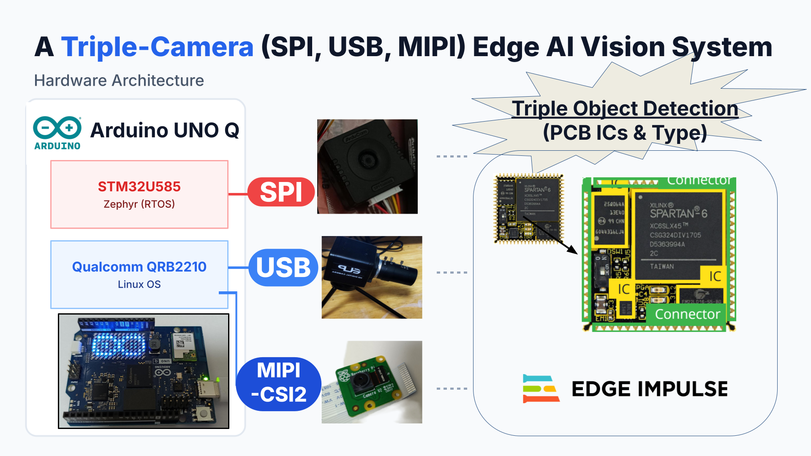

Traditional QA systems are rigid, bulky, and expensive. **The Hybrid Guard** introduces a hybrid, multi-camera edge AI inspection system powered entirely by the **Arduino® UNO Q**. By orchestrating three distinct camera interfaces (MIPI-CSI2, USB, and SPI), this system provides synchronous multi-angle vision coverage and on-device machine learning inference (Edge AI) to detect components, verify part placement, and identify defects right on the production line—all without cloud dependency.

---

## 2. Key Features of this Project

This project's main topics are as follows:

*   **Triple-Camera Vision Coverage**: Integrates MIPI-CSI2, USB, and SPI cameras on a single board to inspect PCBs from three distinct angles simultaneously.
*   **On-Device Edge AI Detections**: Runs real-time object detection models trained via Edge Impulse on both the Qualcomm Linux host and the STM32 MCU.
*   **Synchronized Multi-Angle Frame Saving**: A non-blocking web server on port `7000` supporting one-click synchronized snapshot recording across all three cameras for dataset collection and QA logging.

The following video demonstrates the integrated multi-camera system in action:
🎥 **[Multi-Camera PCB & IC Quality Inspection with Arduino UNO Q](https://youtu.be/zD2ew1YJBvg)**

[](https://youtu.be/zD2ew1YJBvg)


---

## 3. Hardware Design (BOM)

The system leverages the unique dual-architecture of the **Arduino® UNO Q** (combining a Qualcomm QRB2210 Linux Host and an STM32U585 Zephyr RTOS MCU). If you want to check the live camera feeds and detection results via a graphical interface (GUI), you can connect your PC or mobile device to the UNO Q's wireless (Wi-Fi) network and access the integrated WebUI dashboard through your web browser.

### Overall Hardware Block Diagram

```mermaid
graph TD
    classDef mcu fill:#dbeafe,stroke:#1e40af,stroke-width:2px;
    classDef cpu fill:#fef08a,stroke:#854d0e,stroke-width:2px;
    classDef peripheral fill:#f3f4f6,stroke:#4b5563,stroke-width:1.5px;
    classDef power fill:#fee2e2,stroke:#ef4444,stroke-width:1.5px;

    subgraph UNOQ ["Arduino® UNO Q Core"]
        Host["Qualcomm Linux Host<br>(Qualcomm QRB2210 CPU)"]:::cpu
        MCU["STM32U585 MCU<br>(Zephyr RTOS)"]:::mcu
    end

    MIPI["MIPI-CSI2 Camera<br>(Sony IMX219)"]:::peripheral
    Addon["Custom MIPI-CSI2<br>Add-on Board"]:::peripheral
    USB["USB Web Camera<br>(ELP 5-50mm)"]:::peripheral
    SPI["SPI Macro Camera<br>(Arducam Mega)"]:::peripheral
    PIR["PIR Motion Sensor<br>(GPIO Trigger)"]:::peripheral
    LED["RGB Status LEDs<br>(GPIO Output)"]:::peripheral
    Hub["USB-C Hub<br>(Anker 332)"]:::peripheral
    Power["External Power Supply<br>(5V DC Input)"]:::power

    Host -->|MIPI-CSI2 Bus| Addon
    Addon -->|Flat Flex Cable| MIPI
    Host -->|USB Host Bus| Hub
    Power -->|External Power Line| Hub
    Hub -->|USB Connection & Power| USB
    MCU -->|SPI2 Bus & CS PB9| SPI
    MCU <--|GPIO D7 PB2 Interrupt| PIR
    MCU -->|GPIO Status Channels| LED
    Host <-->|Internal SWD / RAM Dump| MCU
```

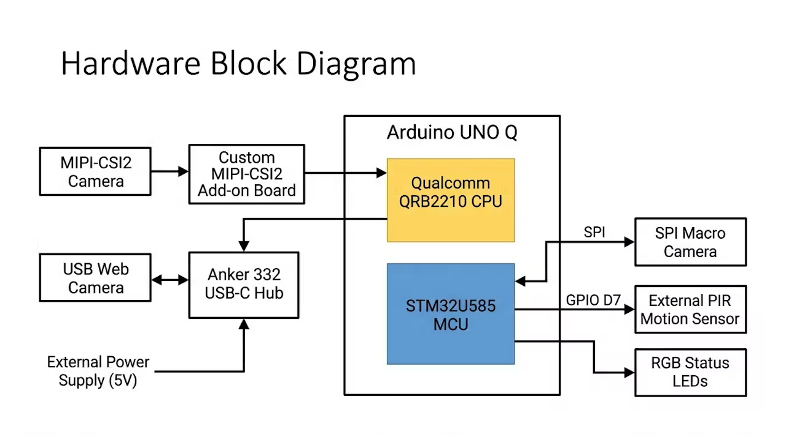

### Hardware Components & Photos

### **Core Unit: [Arduino® UNO Q](https://store.arduino.cc/products/uno-q) (4GB RAM)**

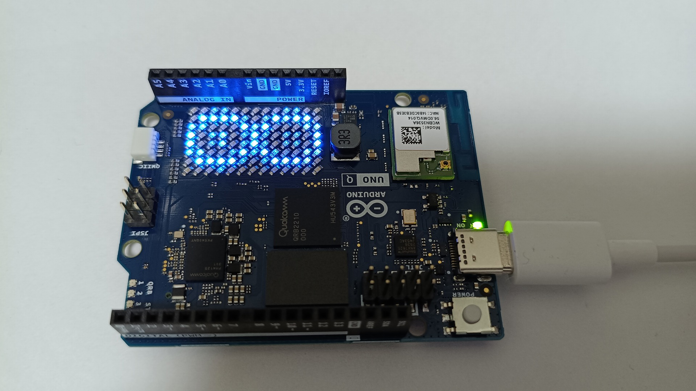

High-performance dual-core host processing unit running Qualcomm Linux and STM32 RTOS.

### **Overhead Camera (MIPI-CSI2): Raspberry Pi Camera v2 (Sony IMX219)**

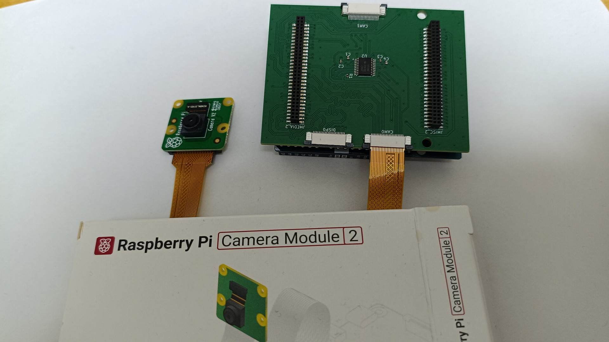

Overhead high-resolution Full HD scanning camera for board inspection.

### **Custom MIPI-CSI2 Add-on Board**

 <br> 

Interface board connecting the MIPI camera to the Arduino UNO Q (Referenced from the [camboard-uno-q](https://github.com/RevLmt/camboard-uno-q) design).

### **Side/Flexible Camera (USB): ELP-USBFHD08s-MFV(5-50) USB Web Camera**

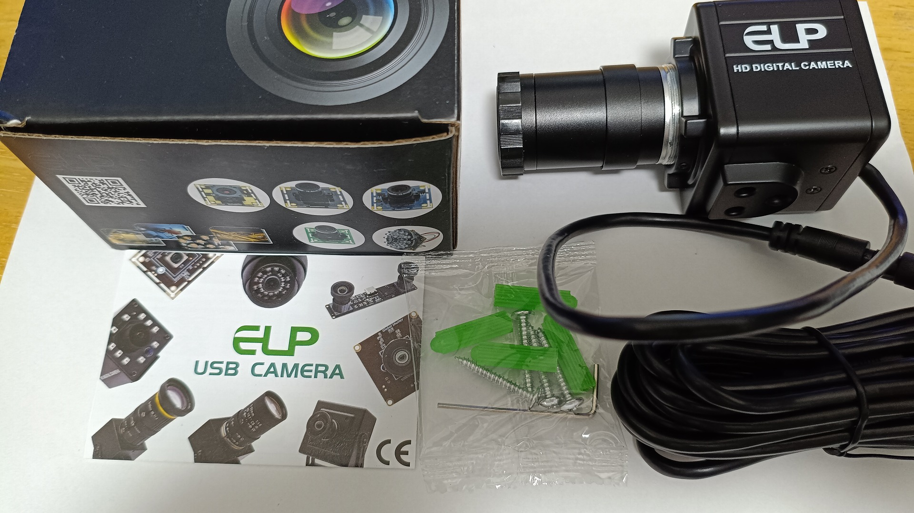

High-speed continuous inspection camera for fast sequential frame capture.

### **USB-C Hub: Anker 332 USB-C Hub**

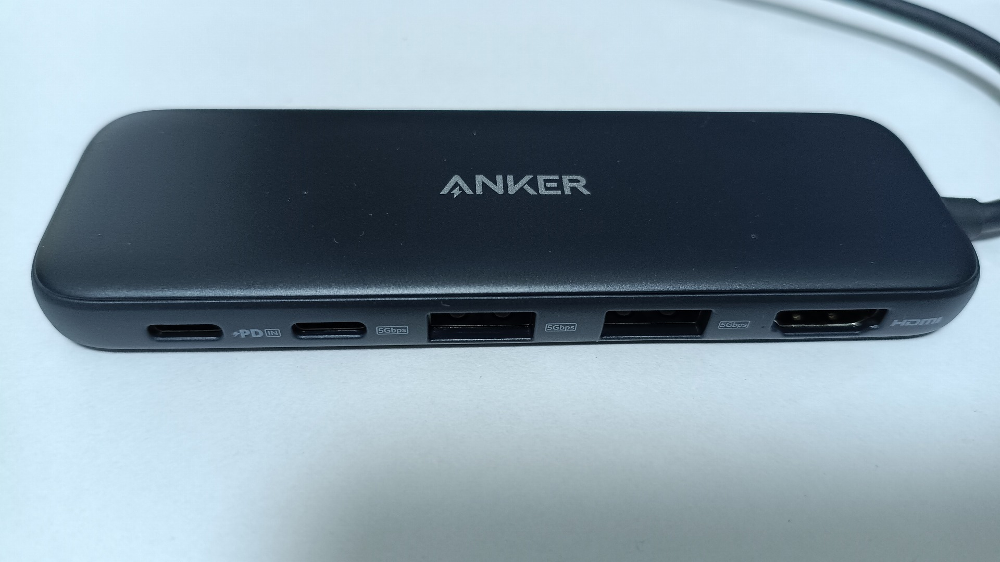

Externally powered USB-C hub providing stable power supply and connection to the USB camera.

### **Macro Camera (SPI): Arducam Mega 3MP SPI Camera**

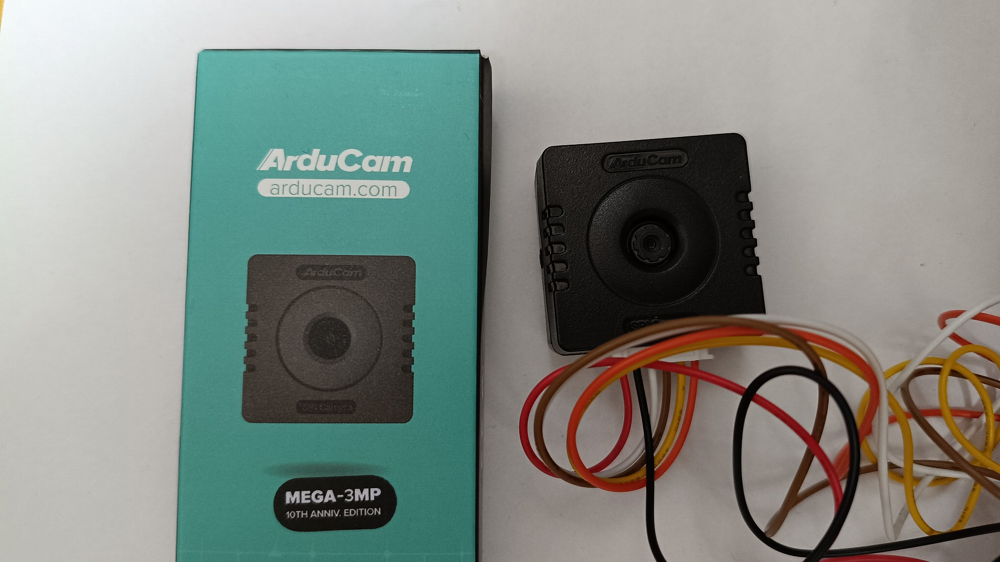

Macro inspection camera connected via JSPI/ICSP header on the MCU.

### **Trigger Sensor: External PIR motion sensor**

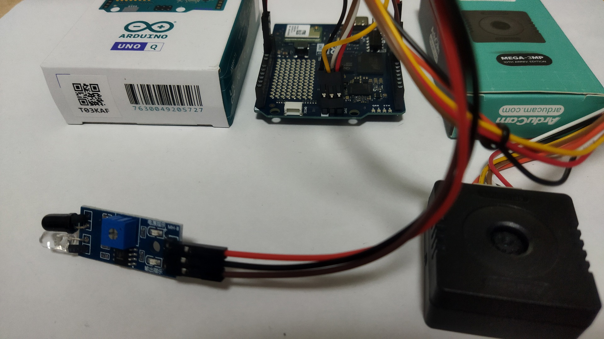

PIR sensor connected to GPIO D7 (`PB2`) for event-driven capture triggers.


### SPI Hardware Connections

Connect the Arducam Mega 3MP and the PIR sensor to the Arduino Uno Q as follows:

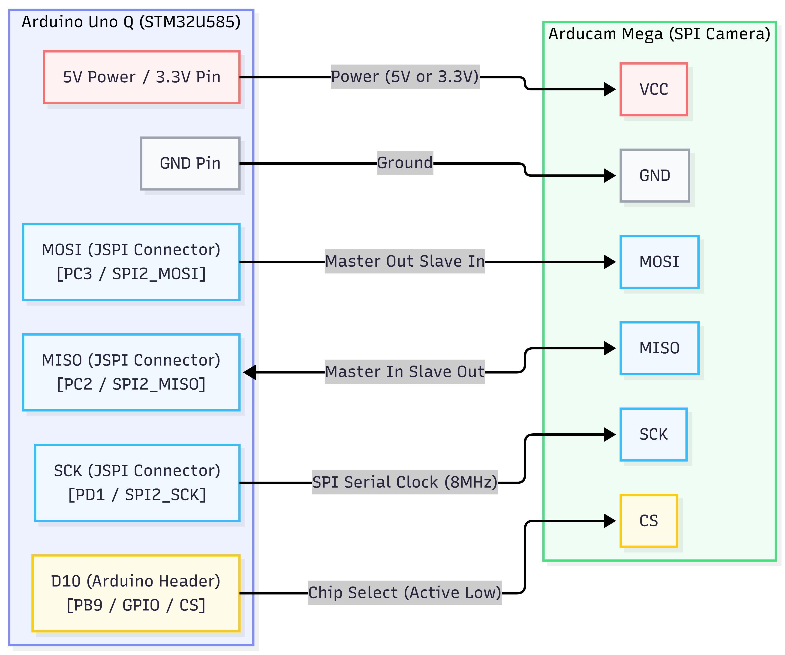

*   **Arducam VCC** connects to **5V (or 3.3V)** (Power) &mdash; Camera module power
*   **Arducam GND** connects to **GND** (Ground) &mdash; Ground reference
*   **Arducam MOSI** connects to **MOSI (JSPI)** (`PC3` (SPI2_MOSI on ICSP)) &mdash; SPI Master Out Slave In
*   **Arducam MISO** connects to **MISO (JSPI)** (`PC2` (SPI2_MISO on ICSP)) &mdash; SPI Master In Slave Out
*   **Arducam SCK** connects to **SCK (JSPI)** (`PD1` (SPI2_SCK on ICSP)) &mdash; SPI Serial Clock
*   **Arducam CS** connects to **D10** (`PB9` (GPIO Control)) &mdash; Chip Select active-low control
*   **PIR VCC** connects to **3.3V (or 5V)** (Power) &mdash; PIR Sensor power
*   **PIR GND** connects to **GND** (Ground) &mdash; Ground reference
*   **PIR OUT** connects to **D7** (`PB2` (Interrupt Input)) &mdash; Active-Low trigger with internal Pull-up

---

## 4. Software & Firmware Architecture

The codebase is structured logically, splitting responsibilities between the high-performance Qualcomm Linux Host (MIPI and USB camera pipelines) and the low-power STM32U585 MCU (SPI camera pipeline and event-driven trigger loop). All firmware and application folders are located inside the [src/](src/) directory:

```text
src/
├── mipi-cam/
│   ├── fps-test/           # Standalone zero-dependency Python web streamer for MIPI setups
│   ├── multi-cam/          # Orchestrator streaming MIPI, USB, and SPI cameras synchronously on port 7000
│   └── object-detect/      # Real-time MIPI object detector with interactive calibration WebUI
├── spi-cam/
│   ├── connect-test/       # Zephyr RTOS test to verify SPI communication with Arducam Mega
│   ├── object-detect/      # Real-time SPI object classification mapping targets to board LEDs
│   └── sensor-camera/      # PIR-triggered deep sleep capture & RGB status LED indicators
└── usb-cam/
    ├── fps-test/           # High-FPS USB camera streamer using Arduino App Lab bricks
    └── object-detect/      # USB camera PCB component detector trained on PCB dataset
```

### 4.1. SPI Camera (STM32U585 Zephyr RTOS)
The SPI camera firmware runs on the STM32 microcontroller using Zephyr RTOS. It connects to the Arducam Mega 3MP camera and includes:
*   **connect-test**: Verifies low-level SPI2 bus communication and chip select control (`D10`/`PB9`) between STM32 and the camera. The test program captures 320x240 (QVGA) photos every few seconds into the MCU SRAM frame buffer. By running the [view_image.py](src/spi-cam/connect-test/view_image.py) script on a PC, developers can extract the raw image buffer from the STM32's RAM via OpenOCD/SWD debug connection and convert it to a local PNG file for verification.
    ```dts
    &arduino_spi {
        status = "okay";
        /* Override to use physical pin configuration for JSPI / ICSP connector */
        pinctrl-0 = <&spi2_sck_pd1 &spi2_miso_pc2 &spi2_mosi_pc3>;
        pinctrl-names = "default";

        cs-gpios = <&arduino_header ARDUINO_HEADER_R3_D10 GPIO_ACTIVE_LOW>;

        arducam_mega: arducam_mega@0 {
            compatible = "arducam,mega";
            reg = <0>;
            spi-max-frequency = <4000000>;
            status = "okay";
        };
    };
    ```
*   **object-detect**: Implements real-time on-device classification in C++ using the Edge Impulse C++ SDK. The camera captures a physical 320x320 square frame, which is dynamically downscaled via an average-pooling scaling algorithm to a 96x96 input resolution to run object detection/classification inference.
    
    ##### 📂 Project Directory Structure
    To compile the model inside Zephyr RTOS, the Edge Impulse C++ source and parameter folders are structured inside the application directory:
    ```text
    src/spi-cam/object-detect/
    ├── CMakeLists.txt        # Integrates SDK and model sources
    ├── prj.conf              # Configures stack size and float support
    ├── app.overlay           # Device tree pin configurations
    ├── src/
    │   └── main.cpp          # Classification loop setting status LEDs
    ├── edge-impulse-sdk/     # Core Edge Impulse C++ SDK library
    ├── model-parameters/     # Input parameters, labels, and DSP config
    └── tflite-model/         # Compiled C++ TensorFlow Lite neural network model
    ```

    ##### 🛠️ CMakeLists.txt Configuration
    The project is linked to the Edge Impulse model directories and static allocation flags via `CMakeLists.txt`:
    ```cmake
    # Define Edge Impulse Static Allocation to avoid heap allocation
    zephyr_compile_definitions(EI_CLASSIFIER_ALLOCATION_STATIC)

    # Include paths for Edge Impulse model, parameters & SDK parent directory
    target_include_directories(app PRIVATE 
        ${CMAKE_CURRENT_SOURCE_DIR}
        ${CMAKE_CURRENT_SOURCE_DIR}/model-parameters
        ${CMAKE_CURRENT_SOURCE_DIR}/tflite-model
    )

    # Model compiled C++ sources
    target_sources(app PRIVATE
        tflite-model/tflite_learn_1061869_5_compiled.cpp
    )

    # Add Edge Impulse SDK sources and configurations
    add_subdirectory(edge-impulse-sdk/cmake/zephyr)
    ```

    ##### 💻 Real-Time Inference Loop
    The classification loop runs inside `main.cpp` using the following steps:
    1. **Prepare Signal Wrapper**: Wraps the downscaled `image_buffer` using the `signal_t` structure, binding the callback `get_camera_data` to unpack the RGB565 pixels into normalized float formats.
    2. **Run Classifier**: Calls the core SDK function `run_classifier()` to run neural network inference on the MCU.
    3. **LED Classification Mapping**: Loops through the detected bounding boxes, filtering targets with confidence `>= 0.5f` to identify the board type (`pico`, `xiao`, `nrf54l15`, `fpc`) and maps the result to GPIO control outputs for the onboard RGB LEDs.
    
    ```cpp
    // 1. Prepare input signal structure
    signal_t signal;
    signal.total_length = EI_CLASSIFIER_DSP_INPUT_FRAME_SIZE;
    signal.get_data = &get_camera_data;

    // 2. Execute on-device Edge Impulse model inference
    ei_impulse_result_t result = { 0 };
    EI_IMPULSE_ERROR ei_ret = run_classifier(&signal, &result, false);

    // 3. Map high-confidence detections (>= 0.5) to RGB LEDs
    uint8_t r_val = 0, g_val = 0, b_val = 0;
    for (size_t ix = 0; ix < result.bounding_boxes_count; ix++) {
        auto bb = result.bounding_boxes[ix];
        if (bb.value >= 0.5f) {
            if (strcmp(bb.label, "pico") == 0) {
                b_val = 1; // Blue
            } else if (strcmp(bb.label, "xiao") == 0) {
                g_val = 1; // Green
            } else if (strcmp(bb.label, "nrf54l15") == 0) {
                r_val = 1; // Red
            } else if (strcmp(bb.label, "fpc") == 0) {
                r_val = 1; g_val = 1; // Yellow
            }
            break;
        }
    }
    gpio_pin_set_dt(&led_red, r_val);
    gpio_pin_set_dt(&led_green, g_val);
    gpio_pin_set_dt(&led_blue, b_val);
    ```
*   **sensor-camera**: A low-power, event-driven application. It configures PIR sensor pin D7 (`PB2`) as a GPIO interrupt with an internal pull-up, waking the MCU from deep sleep on motion, capturing a single frame, running Edge Impulse classification, and stopping the video stream dynamically to prevent sensor overheating.
    ```cpp
    // PIR Trigger and Dynamic Video Stream Lifecycle Loop
    k_sem_take(&pir_sem, K_FOREVER); // Block until motion is detected
    video_stream_start(camera_dev, VIDEO_BUF_TYPE_OUTPUT); // Wake camera
    ret = video_dequeue(camera_dev, &captured_buf, K_FOREVER); // Capture frame
    // ... (Execute Edge Impulse classification & update LEDs) ...
    video_stream_stop(camera_dev, VIDEO_BUF_TYPE_OUTPUT); // Enter sleep
    ```

🎥 **Watch the Demo Video**: [Object Detection with Arducam Mega SPI Camera on Arduino UNO Q](https://youtu.be/WYfk6TL4Gcw)

[](https://youtu.be/WYfk6TL4Gcw)

#### SPI Camera Detection Gallery
*   **Target: pico**
    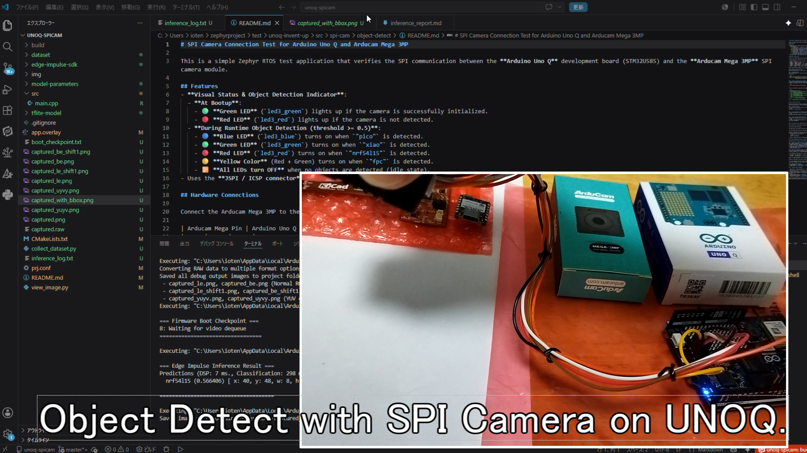

*   **Target: xiao**
    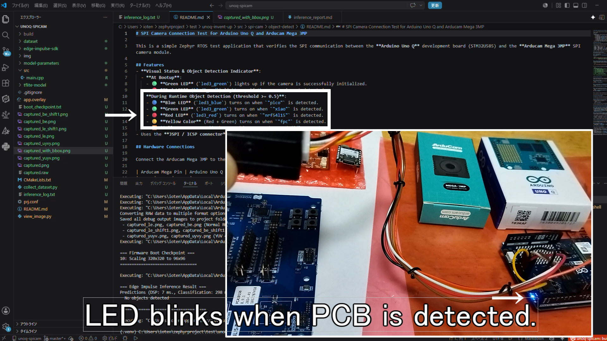

*   **Target: nrf54l15**
    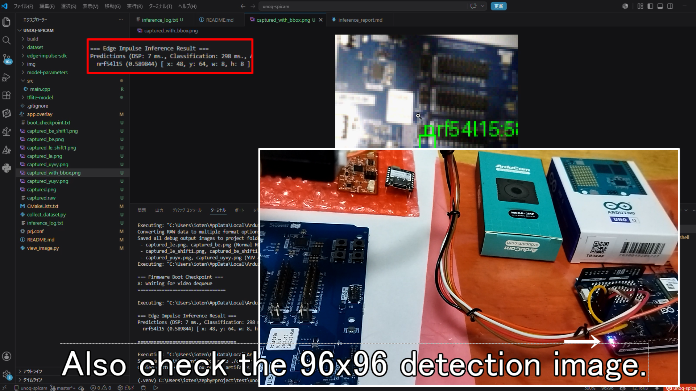


*   **Target: fpc**
    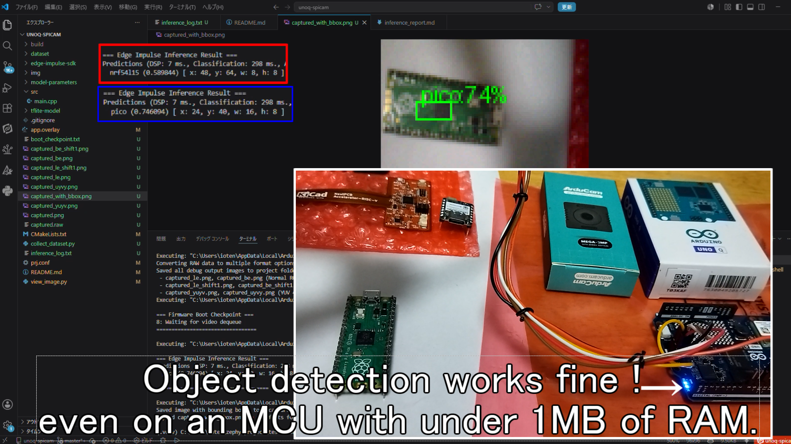

*   **Active SPI Console Inference Log**
    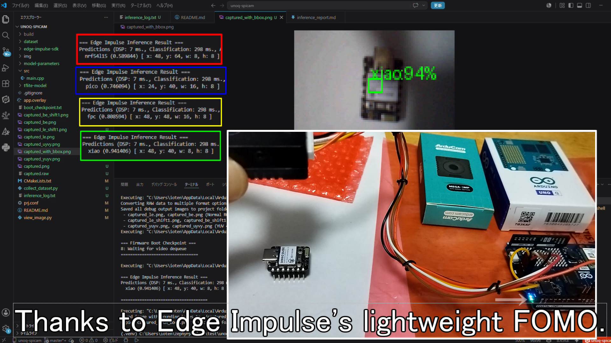


### 4.2. USB Camera (Qualcomm Linux Host)
The USB camera applications run on the Linux Host side (Qualcomm QRB2210), connecting to the ELP-USBFHD08s-MFV(5-50) USB Web Camera. These applications are developed by adapting and extending the official Object Detection template from the Arduino App Lab platform:
*   **fps-test**: Leverages OpenCV and FastAPI's `StreamingResponse` to implement non-blocking MJPEG streaming. It disables object-detection processes to maximize raw camera bandwidth and run at the hardware's highest frame rate. It features:
    
    ##### 📸 Frame Capture & Local Saving
    When the user clicks "Start Save" in the WebUI, the background capture thread toggles `is_saving` to write each JPEG frame to a local folder with microsecond-precision timestamps:
    ```python
    # Capture frame using available camera read methods
    if hasattr(camera, '_read_frame'):
        frame = camera._read_frame()
    elif hasattr(camera, 'read'):
        ret, frame = camera.read()

    # Save JPEG bytes to file if saving is enabled
    if is_saving:
        timestamp = datetime.now().strftime("%Y%m%d_%H%M%S_%f")
        filename = os.path.join(save_dir, f"frame_{timestamp}.jpg")
        with open(filename, "wb") as f:
            f.write(jpeg_bytes)
    ```

    ##### 📊 Real-Time FPS & Resolution Reporting
    The script tracks elapsed time, computes the exact frame rate every 1.0 second, and sends the camera's resolution and FPS directly to the dashboard WebUI:
    ```python
    now = time.time()
    frame_count += 1
    elapsed = now - fps_start_time
    if elapsed >= 1.0:
        fps = frame_count / elapsed
        height, width = frame.shape[:2]
        # Send current camera FPS and resolution to the WebUI
        ui.send_message("fps", message={
            "fps": round(fps, 1),
            "width": width,
            "height": height
        })
        frame_count = 0
        fps_start_time = now
    ```
*   **object-detect**: Runs a custom-trained Edge Impulse object detection model (`.eim`) locally using the Python SDK. It continuously decodes USB frames, overlays bounding boxes on detected ICs and Connectors, and overlays the live inference FPS onto the camera feed.
    ```yaml
    # Configuring the Edge Impulse model (.eim) path in app.yaml
    bricks:
    - arduino:video_object_detection:
        variables:
          EI_OBJ_DETECTION_MODEL: /home/arduino/.arduino-bricks/ei-models/camera-test-linux-aarch64-v4-impulse-#1.eim
    ```
    ```python
    # Calculating and Sending Real-Time Inference FPS to the WebUI
    elapsed = now - fps_start_time
    if elapsed >= 1.0:
        fps = frame_count / elapsed
        ui.send_message("fps", message={"fps": round(fps, 1)})
        frame_count = 0
        fps_start_time = now
    ```

🎥 **Watch the Demo Video**: [Easy Object Detection with USB Camera on Arduino UNO Q](https://youtu.be/gSbLFriOPkc)

[](https://youtu.be/gSbLFriOPkc)

#### USB Camera Detection Gallery
*   **USB Component Detection 1**
    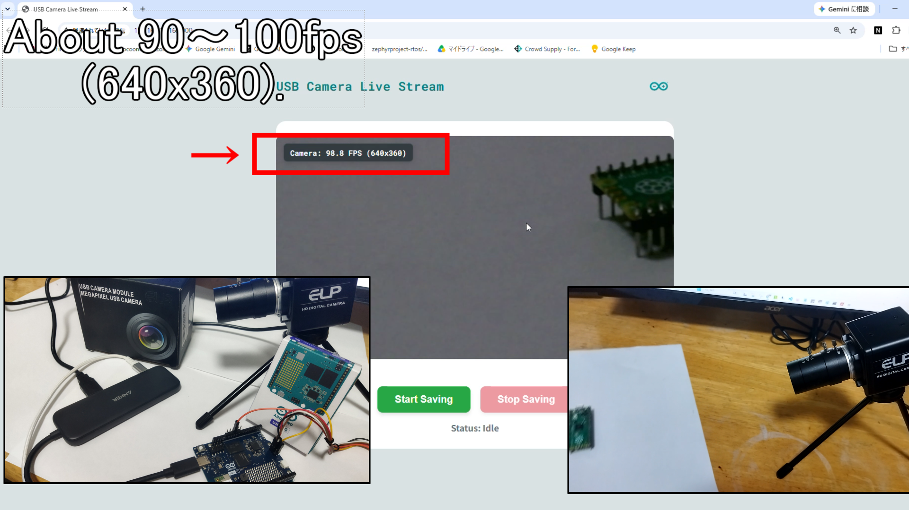

*   **USB Component Detection 2**
    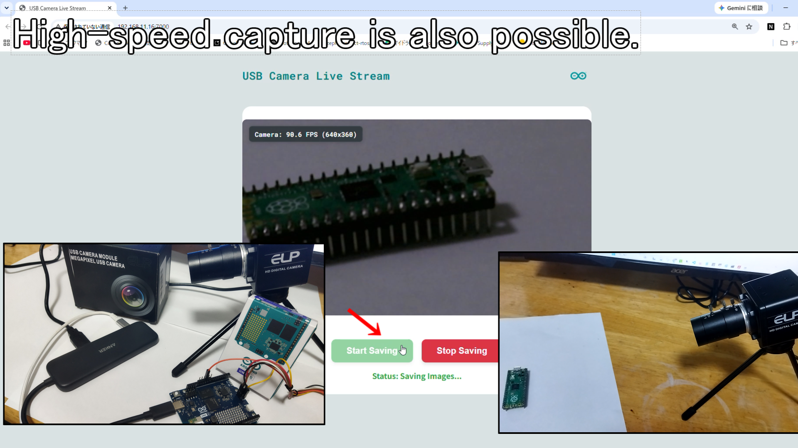

*   **USB Component Detection 3**
    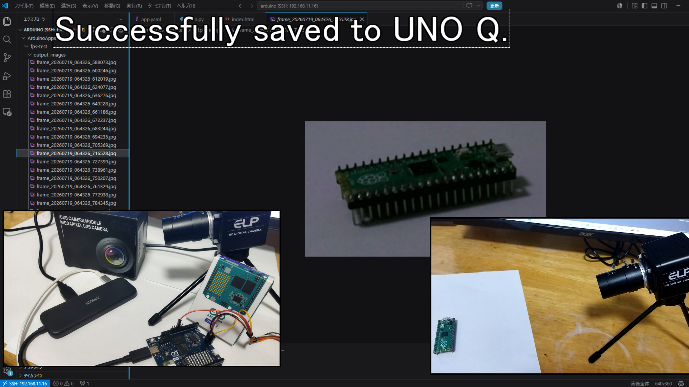


*   **USB Component Detection 4**
    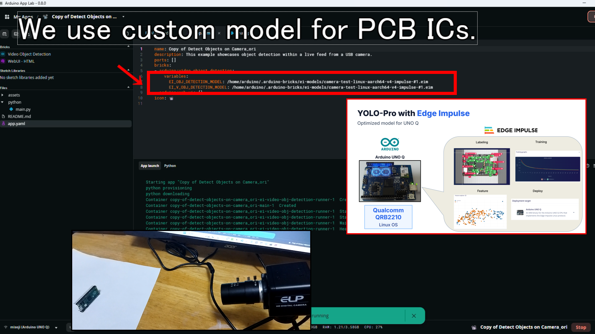

*   **USB Component Detection 5**
    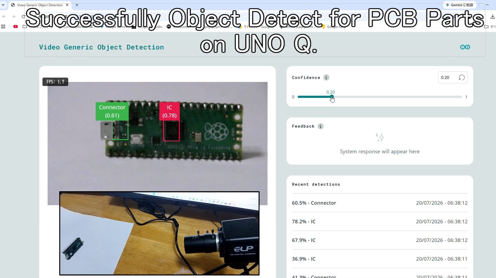

*   **USB Component Detection 6**
    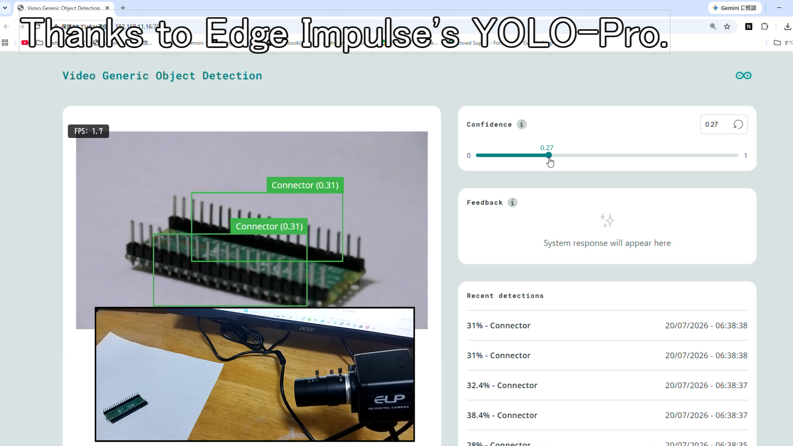


### 4.3. MIPI-CSI2 Camera (Qualcomm Linux Host)
The MIPI-CSI2 camera subsystem operates on Qualcomm Linux using GStreamer (`libcamerasrc`) for high-performance streaming.

##### ⚙️ Camera Module Setup & Kernel Configuration
> [!NOTE]
> The following steps are a quick start summary. For complete step-by-step setup guides, driver configuration details, and troubleshooting notes, please refer to the dedicated [MIPI Camera Setup README](src/mipi-cam/README.md).

To operate the IMX219 camera module on the Arduino UNO Q and resolve device tree dependency errors, follow this kernel and device tree configuration workflow:

1. **Compile & Apply Device Tree Overlay**:
   Compile the powerfix device tree overlay and apply it to the base dtb:
   ```bash
   # Compile DTS overlay to DTBO
   dtc -@ -I dts -O dtb -o unoq-imx219-powerfix.dtbo unoq-imx219-powerfix.dts
   dtc -@ -I dts -O dtb -o qrb2210-arduino-imola-camera-rpiv2.dtb qrb2210-arduino-imola-camera-rpiv2.dts
   
   # Merge and apply the overlay
   fdtoverlay -i qrb2210-arduino-imola-camera-rpiv2.dtb unoq-imx219-powerfix.dtbo -o qrb2210-arduino-imola-camera-rpiv2-r1b.dtb
   
   # Copy the generated DTB to boot directory
   sudo mkdir -p /boot/efi/dtb/r1b/
   sudo cp qrb2210-arduino-imola-camera-rpiv2-r1b.dtb /boot/efi/dtb/r1b/
   ```

2. **Kernel Rollback Configuration**:
   Update `systemd-boot` loader config `/boot/efi/loader/loader.conf` to default to stable kernel **6.16.7** to prevent bootloader cycles:
   ```ini
   default 3e660e15577e4d88ad85a3673a183368-6.16.7-g0dd6551ae96b.conf
   ```
   Then reboot the board: `sudo reboot`

3. **Install Camera Toolchain**:
   Install necessary libcamera and GStreamer plugins:
   ```bash
   sudo apt update
   sudo apt install libcamera-tools gstreamer1.0-libcamera
   ```

4. **Verify Camera stream**:
   Verify offscreen camera streaming capabilities:
   ```bash
   QT_QPA_PLATFORM=offscreen qcam
   ```

*   **fps-test**: A zero-dependency high-FPS Python web server utilizing standard library modules (`http.server`, `subprocess`). It launches a hardware-binned `1280x720` GStreamer pipeline to minimize debayering latency and records JPG frames locally with millisecond-precision timestamps.
    ```python
    # Low-Latency GStreamer Pipeline launching libcamerasrc via subprocess
    cmd = [
        "gst-launch-1.0", "-q",
        "libcamerasrc", "!",
        "video/x-raw,width=1280,height=720,framerate=30/1", "!",
        "videoconvert", "!",
        "jpegenc", "quality=80", "idct-method=1", "!",
        "fdsink", "sync=false", "async=false"
    ]
    proc = subprocess.Popen(cmd, stdout=subprocess.PIPE, stderr=subprocess.PIPE, env=clean_env)
    ```
*   **object-detect**: Implements Full HD (1920x1080) PCB component detection using Edge Impulse Linux Python SDK models. It features a multithreaded web server on port 7000 and provides sliders in the browser to control camera properties like RGB Gains (to fix green tint), Contrast, and Dehaze/Defog filtering.

    ##### 🧠 Loading and Running `.eim` Models on Linux Host
    To perform object detection on the Qualcomm host CPU, the script initializes the compiled Edge Impulse executable model (`.eim`) file and passes packed features:
    
    1. **Initialize Runner**: The script imports `ImpulseRunner` from `edge_impulse_linux.runner` and starts the model container.
    2. **Features Preparation & Packing**: Decoded video frames are resized to the target model resolution (e.g., 640x640), converted to RGB format, and packed as a single 1D array of 32-bit pixel words (`0x00RRGGBB` format).
    3. **Run Inference**: Invokes `runner.classify(packed_features)` to calculate prediction bounding boxes.
    
    ```python
    # 1. Load and initialize the compiled .eim model
    runner = ImpulseRunner(EIM_FILE)
    model_info = runner.init()
    input_w = model_info["model_parameters"]["image_input_width"]
    input_h = model_info["model_parameters"]["image_input_height"]

    # 2. Pre-resize, convert to RGB, and pack pixel features into 0x00RRGGBB format
    frame_resized = cv2.resize(frame, (input_w, input_h))
    img_rgb = cv2.cvtColor(frame_resized, cv2.COLOR_BGR2RGB)
    img_u32 = img_rgb.astype(np.uint32)
    packed_features = ((img_u32[:, :, 0] << 16) | (img_u32[:, :, 1] << 8) | img_u32[:, :, 2]).astype(np.float32).reshape(-1)

    # 3. Perform local model inference
    res = runner.classify(packed_features)
    ```

    ##### 🎨 Live Tuning Filters
    The BGR video frame is dynamically adjusted before inference based on the WebUI dashboard controls (applying CLAHE for defog/dehaze and custom RGB gain scaling):
    ```python
    # CLAHE Contrast Tuning (Dehaze/Defog Filter) and RGB Gain Balancing
    if defog_val > 0:
        lab = cv2.cvtColor(img, cv2.COLOR_BGR2LAB)
        l, a, b = cv2.split(lab)
        clahe = cv2.createCLAHE(clipLimit=(1.5 + float(defog_val) * 0.4), tileGridSize=(8, 8))
        l = clahe.apply(l)
        img = cv2.cvtColor(cv2.merge([l, a, b]), cv2.COLOR_LAB2BGR)
        
    b, g, r = cv2.split(img.astype(np.float32))
    r *= float(r_gain); g *= float(g_gain); b *= float(b_gain)
    img = np.clip(cv2.merge([b, g, r]), 0, 255).astype(np.uint8)
    ```

🎥 **Watch the Demo Video**: [High-Resolution Object Detection with MIPI-CSI 2 Camera on Arduino UNO Q](https://youtu.be/3DzF_QH86bY)

[](https://youtu.be/3DzF_QH86bY)

#### MIPI-CSI2 Camera Detection Gallery
*   **MIPI Component Detection 1**
    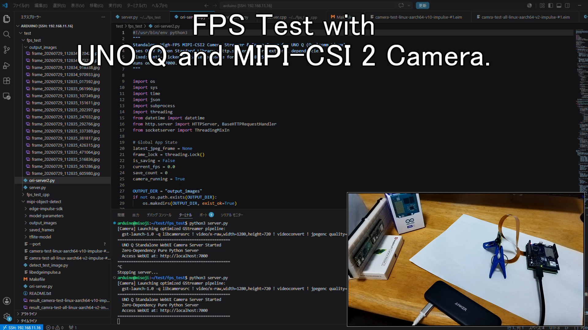

*   **MIPI Component Detection 2**
    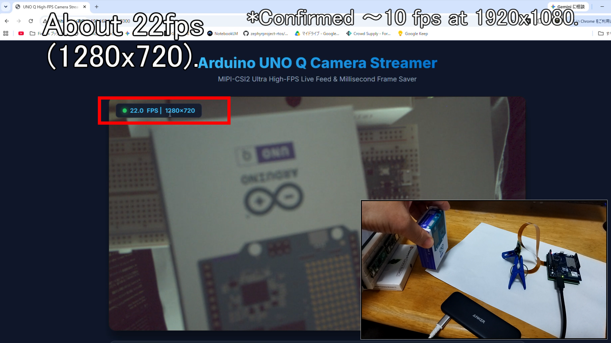

*   **MIPI Component Detection 3**
    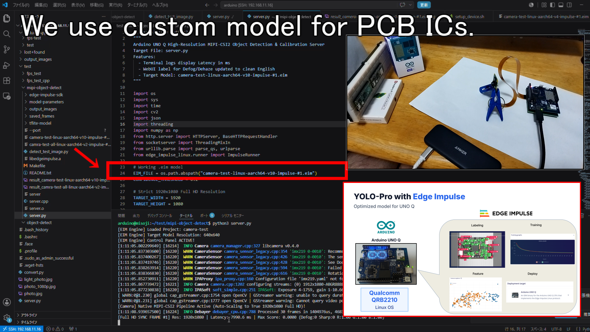


*   **MIPI Component Detection 4**
    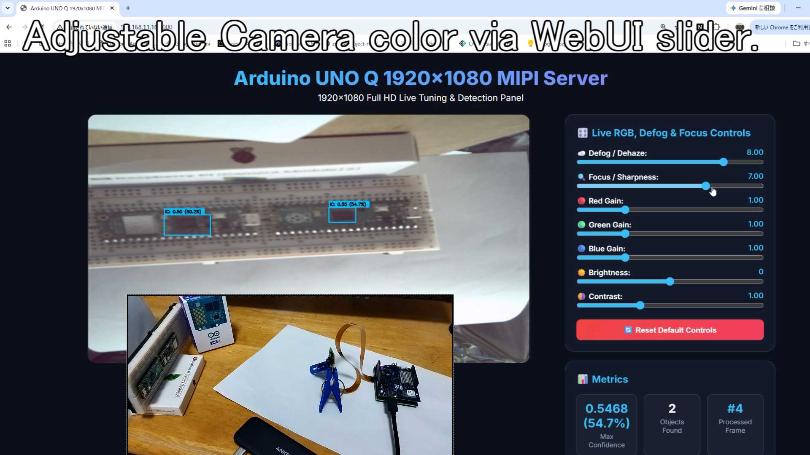

*   **MIPI Component Detection 5**
    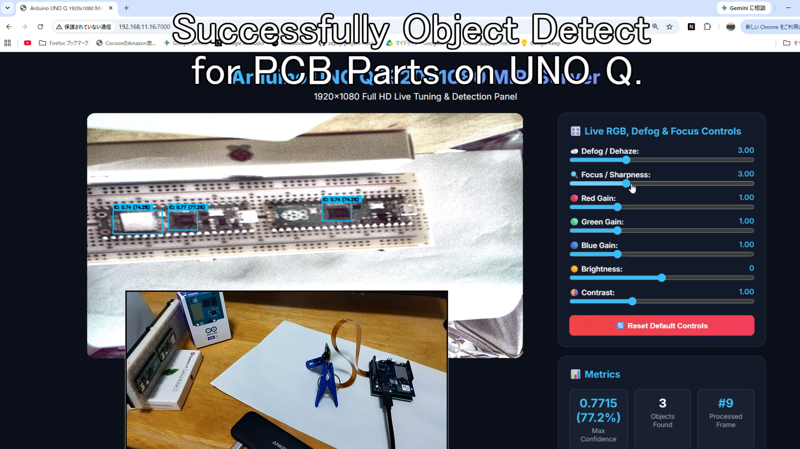

*   **MIPI Component Detection 6**
    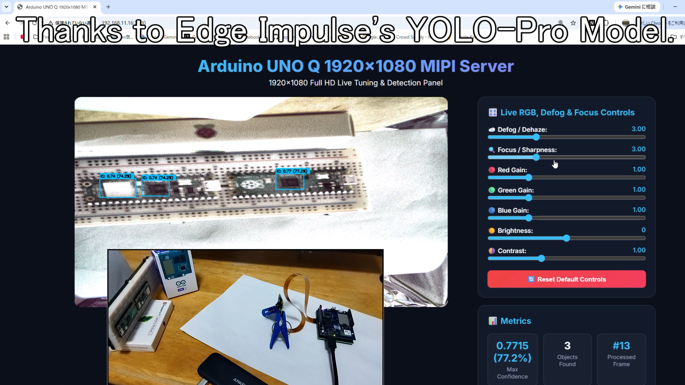


### 4.4. Multi Camera (Qualcomm Linux Host)
The Multi-Camera orchestrator runs `multi-cam.py` to capture live feeds from the MIPI-CSI2 camera, the USB Web camera, and the SPI camera simultaneously. It outputs a synchronized, responsive 3-column layout on port 7000.
*   **Synchronized Web Stream Endpoints**: Combines independent GStreamer and OpenCV capture threads, serving non-blocking camera feeds on a multithreaded HTTP server.
    ```python
    # Synchronous Multi-Camera HTTP Handlers in multi-cam.py
    class CameraHTTPRequestHandler(BaseHTTPRequestHandler):
        def do_GET(self):
            # 1. MIPI-CSI2 Live MJPEG stream endpoint
            if self.path == '/video_feed/mipi':
                self.send_response(200)
                self.send_header('Content-Type', 'multipart/x-mixed-replace; boundary=frame')
                # ... (writes frame bytes continuously from latest_mipi_frame) ...

            # 2. USB Web Camera Live MJPEG stream endpoint
            elif self.path == '/video_feed/usb':
                self.send_response(200)
                self.send_header('Content-Type', 'multipart/x-mixed-replace; boundary=frame')
                # ... (writes frame bytes continuously from latest_usb_frame) ...

            # 3. SPI Close-up Camera PNG snapshot endpoint (polled dynamically)
            elif self.path.startswith('/video_feed/spi_png'):
                with open(PNG_FILE_BOARD, "rb") as f:
                    self.wfile.write(f.read())
    ```
*   **Responsive 3-Column HTML Grid**: Embeds all three streams in a unified dashboard using CSS grids, enabling real-time multi-angle QA comparison.
    ```html
    <!-- Responsive 3-Column Layout Grid displaying MIPI, USB, and SPI streams -->
    <div class="triple-grid">
        <div class="video-card">
            
        </div>
        <div class="video-card">
            
        </div>
        <div class="video-card spi-card">
            
        </div>
    </div>
    ```

🎥 **Watch the Demo Video**: [Multi-Camera PCB & IC Quality Inspection with Arduino UNO Q](https://youtu.be/zD2ew1YJBvg)

[](https://youtu.be/zD2ew1YJBvg)

#### Multi-Camera Dashboard Gallery
*   **Triple-Camera Live Dashboard 1**
    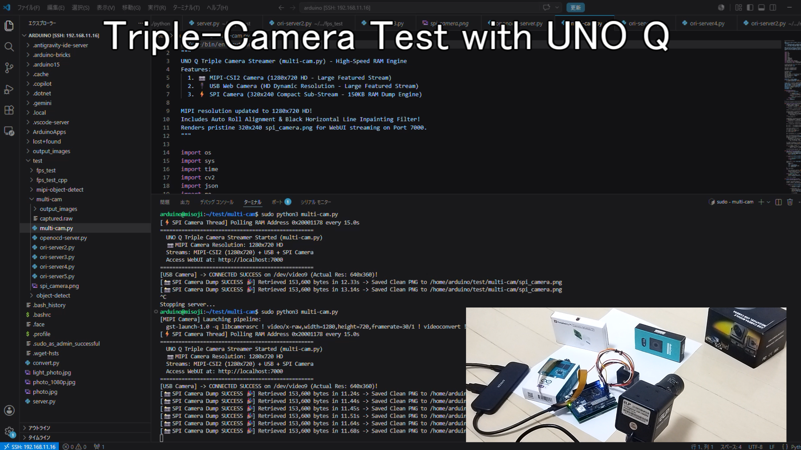

*   **Triple-Camera Live Dashboard 2**
    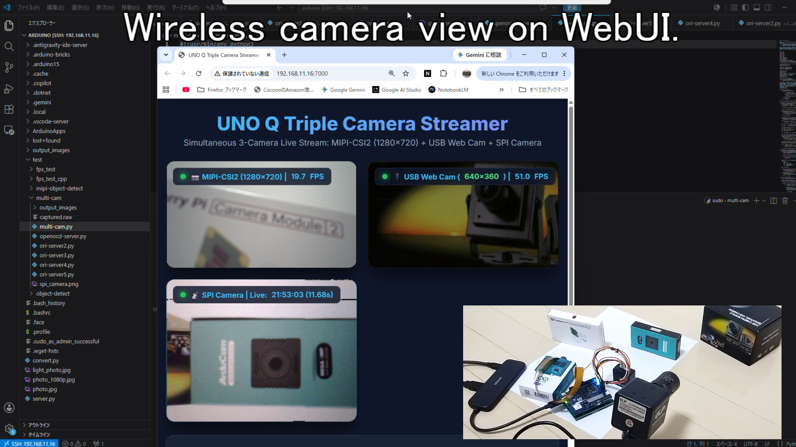

*   **Triple-Camera Live Dashboard 3**
    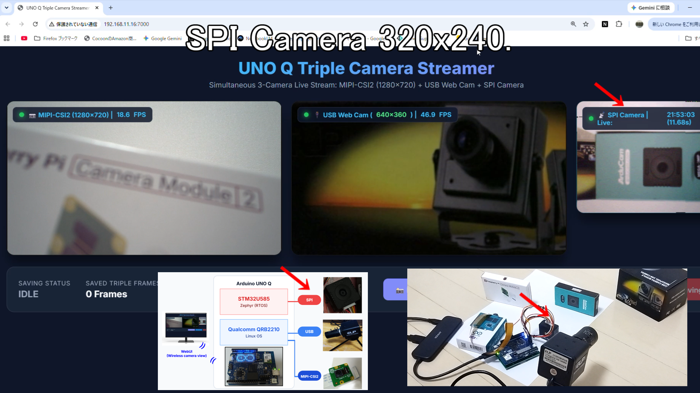


*   **Triple-Camera Live Dashboard 4**
    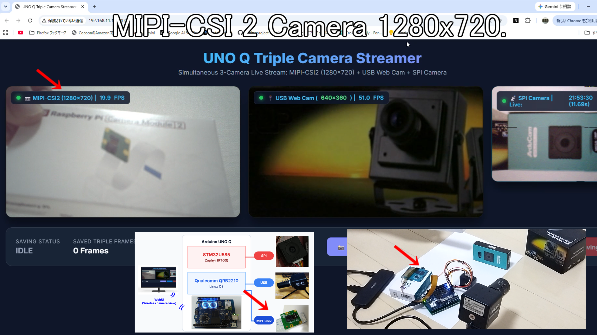

*   **Triple-Camera Live Dashboard 5**
    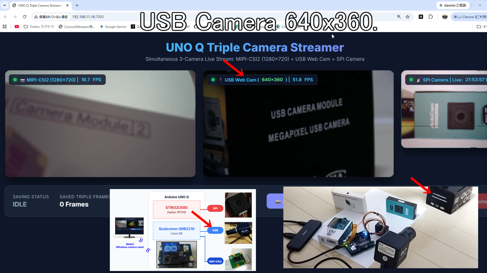


---

## 5. PCB Component Detection & Classification with Edge Impulse

This PCB inspection project uses the Arduino® UNO Q to detect and classify components on printed circuit boards flowing down an industrial production line. All on-device object detection and classification models in this project were created, trained, and optimized using the [Edge Impulse Studio](https://studio.edgeimpulse.com) platform. The system splits inspection duties across the three camera interfaces based on the specific physical requirements of the QA station.

### System Overview & Inspection Concept Slides

*   **Slide 1: Concept & Camera Pipeline**
    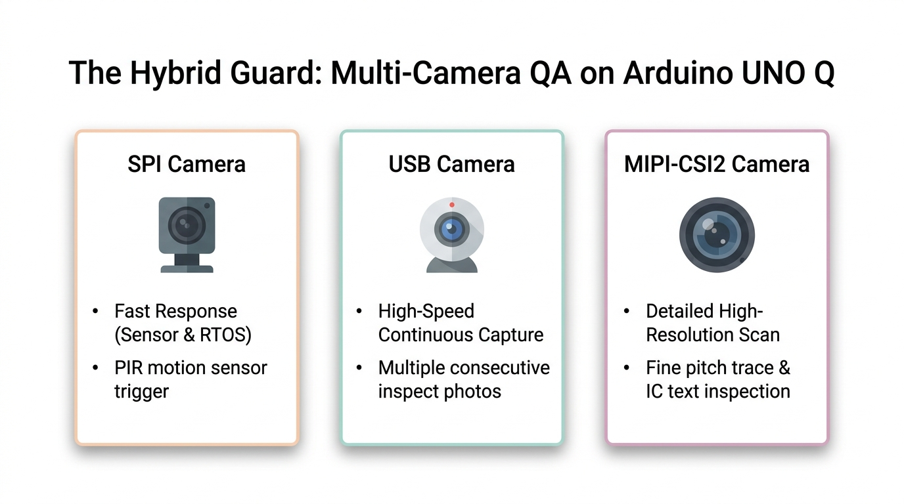

*   **Slide 2: Multi-Perspective Inspection Scenes**
    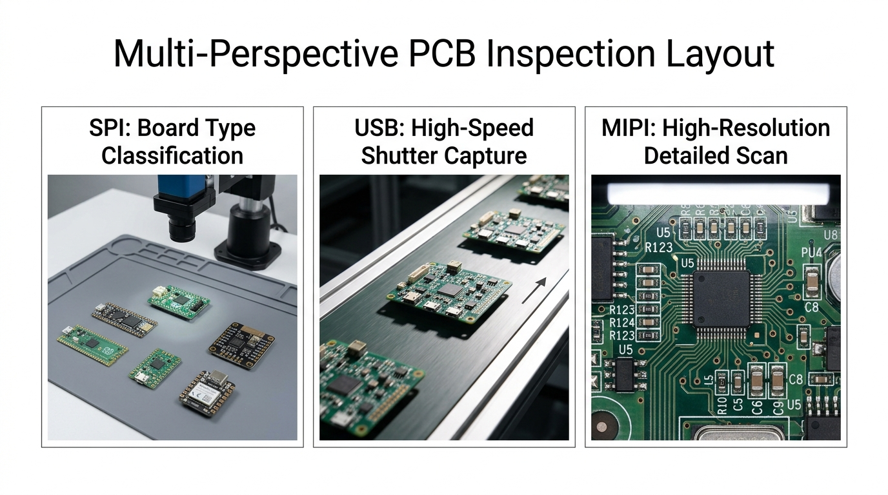


*   **Fast Response with Sensor & RTOS (SPI Camera)**:
    As a PCB enters the conveyor line, it triggers an external PIR sensor. The low-power STM32 MCU wakes from deep sleep, initializes the SPI camera (Arducam Mega 3MP), captures a frame, and runs the Edge Impulse on-device model instantly to classify the board in real-time into one of four target types: `"pico"`, `"xiao"`, `"nrf54l15"`, or `"fpc"`.
    *   **Model**: **FOMO (Faster Objects, More Objects)** object detection model, selected for ultra-fast, low-latency execution on microcontrollers. Used for board type classification.
    *   **Model Input Resolution**: **96x96** (The physical 320x320 frame is dynamically downscaled via average pooling to fit within the STM32 microcontroller's strict SRAM memory boundaries).
    *   **Dataset**: Custom-prepared dataset, consisting of several dozen photos for each of the 4 target PCB types.
    
    ##### SPI Camera Inspection Output
*   **Target: pico**
    

*   **Target: xiao**
    

*   **Target: nrf54l15**
    

    
*   **High-Speed Continuous Inspection (USB Camera)**:
    For line segments where PCBs pass rapidly and multiple consecutive photographs are required to verify placement in quick succession, the high-speed USB camera (**ELP-USBFHD08s-MFV(5-50)**) is deployed. It captures and streams frames at high frame rates, running the Edge Impulse PCB component detector to identify ICs and Connectors on the fly.
    *   **Model**: **YOLO-Pro** object detection model, deployed on the Linux Host CPU to run non-blocking frame classifications.
    *   **Model Input Resolution**: **320x320** (Optimized for maximum processing speed, ensuring low-latency bounding box tracking on live USB video feeds).
    *   **Dataset**: Trained on the [Roboflow 100 Printed Circuit Board Dataset](https://universe.roboflow.com/roboflow-100/printed-circuit-board) (while the raw dataset contains a wide variety of micro-component labels, this model was trained specifically to target Connectors and ICs for focused QA verification).
    
    ##### USB Camera Inspection Output
*   **Component Detect 1**
    

*   **Component Detect 2**
    

*   **Component Detect 3**
    

    
*   **Detailed High-Resolution Scan (MIPI-CSI2 Camera)**:
    For inspection checkpoints requiring maximum detail—such as checking fine-pitch traces, checking part numbers, or reading micro-markings on individual ICs—the high-resolution MIPI-CSI2 camera (IMX219) is utilized. It performs Full HD scans to capture ultra-crisp macro images for deep analysis and precise bounding-box detection.
    *   **Model**: **YOLO-Pro** object detection model (Shares the same model architecture and training dataset configuration as the USB camera model, with the only difference being the higher input resolution of 640x640 to capture the fine details of the MIPI sensor).
    *   **Model Input Resolution**: **640x640** (Configured for high precision, allowing the model to detect tiny markings and component details under macro lens amplification).
    *   **Dataset**: Trained on the [Roboflow 100 Printed Circuit Board Dataset](https://universe.roboflow.com/roboflow-100/printed-circuit-board) (specifically optimized to isolate Connectors and ICs to verify placement on high-resolution scans).
    
    ##### MIPI-CSI2 Camera Inspection Output
*   **Part Detect 1**
    

*   **Part Detect 2**
    

*   **Part Detect 3**
    

*   **Part Detect 4**
    


---

## 6. Lessons Learned & Engineering Insights

Building **The Hybrid Guard** provided key insights into the engineering trade-offs of combining dual-core systems (RTOS MCU + Linux Host) with multiple vision streams and Edge AI:

### 1. SPI Camera Bandwidth & Clock Speed Constraints
*   **Insight**: Image data transmission over the SPI bus is a major bottleneck compared to native MIPI-CSI2 or USB pipelines.
*   **Measurement**: Profiled time for a **320x240 RGB565 frame (153.6 KB)** capture and transfer:
    *   **4 MHz SPI Clock**: `984 ms` (Baseline)
    *   **8 MHz SPI Clock**: `677 ms` (**31.2% speedup**)
*   **Takeaway**: 8 MHz was the hardware limit for the Arducam Mega. Even at this maximum clock speed, it takes over half a second to fetch a single frame. SPI is highly suitable for event-triggered snapshots (e.g. PIR sensor alerts) but not for continuous video-rate feeds.

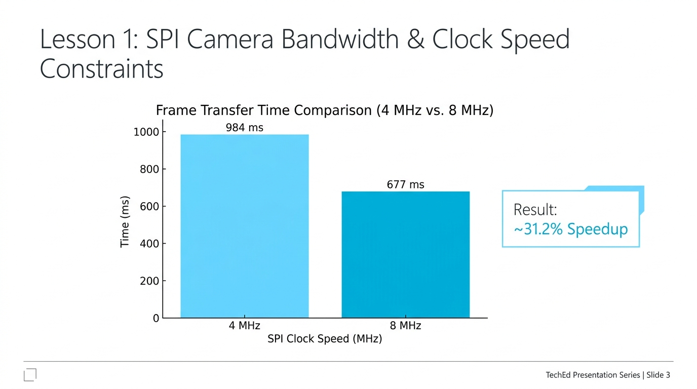

### 2. Microcontroller SRAM Capacity vs. Capture Resolution
*   **Insight**: The STM32U585 MCU has 768 KB of SRAM. Storing full-resolution frame buffers alongside neural network tensors leaves very little margin.
*   **SRAM Allocation Profile (320x320 Frame + Double Buffering)**:
    *   **Double Video Buffer Pool**: `440,000 Bytes` (57.29% of total 768 KB RAM / 65.40% of used RAM) to allow concurrent camera capture and inference.
    *   **TFLite Tensor Arena**: `153,936 Bytes` (20.04% of total 768 KB RAM / 22.88% of used RAM) for the Edge Impulse C++ SDK scratch space.
    *   **Main Thread Stack**: `32,768 Bytes` (4.27% of total 768 KB RAM / 4.87% of used RAM).
    *   **Image Workspace Buffer**: `18,432 Bytes` (2.40% of total 768 KB RAM / 2.74% of used RAM).
    *   **Total SRAM Usage**: **87.60%** (`672,741 Bytes` / `768 KB`).
    *   **Total Flash (ROM) Usage**: **6.67%** (`136,632 Bytes` / `2 MB`).
*   **Takeaway**: Capturing at higher resolutions like VGA (640x480) requires 614 KB for just one frame, making it impossible to run on-device. Resizing down to 96x96 using an average-pooling algorithm is essential to fit the model parameters and image buffers in memory.

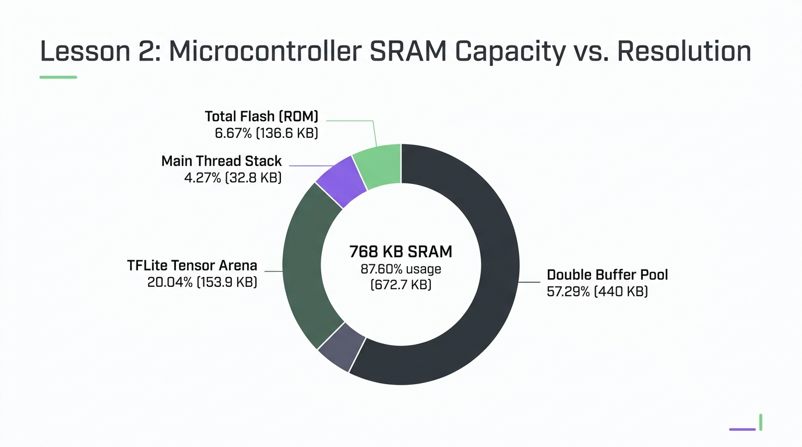

### 3. YOLO-Pro Inference Bottlenecks on Host CPU
*   **Insight**: High camera capture frame-rates do not guarantee high object-detection throughput.
*   **Observation**: While the physical USB web camera streams at about 100 FPS, YOLO-Pro inference runs at only a few FPS on the host CPU.
*   **Takeaway**: This performance bottleneck is primarily caused by selecting a relatively large model size during training to prioritize detection precision over speed. Consequently, the current parameters are too heavy for fast CPU execution. Future iterations should prioritize INT8 quantization and choose a lighter model architecture (such as FOMO or a pruned YOLO variant) to bring the inference rate closer to the native video speed.

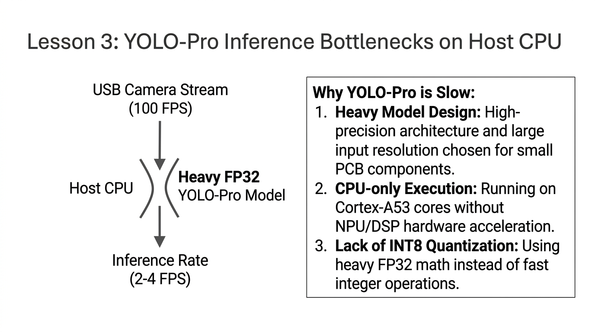

### 4. MIPI-CSI2 Sensor Image Calibration
*   **Insight**: Raw MIPI-CSI2 camera sensors are highly sensitive to default driver tunings, lighting conditions, and lens types, often resulting in heavy green tints or poor contrast.
*   **Solution**: Implemented real-time calibration filters in python controlled via the WebUI (CLAHE for defogging/contrast and custom scaling parameters for RGB gains):
    ```python
    # CLAHE contrast enhancement & manual RGB gain balancing
    if defog_val > 0:
        lab = cv2.cvtColor(img, cv2.COLOR_BGR2LAB)
        l, a, b = cv2.split(lab)
        clahe = cv2.createCLAHE(clipLimit=(1.5 + float(defog_val) * 0.4), tileGridSize=(8,8))
        l = clahe.apply(l)
        img = cv2.cvtColor(cv2.merge([l, a, b]), cv2.COLOR_LAB2BGR)
        
    b, g, r = cv2.split(img.astype(np.float32))
    r *= float(r_gain); g *= float(g_gain); b *= float(b_gain)
    img = np.clip(cv2.merge([b, g, r]), 0, 255).astype(np.uint8)
    ```

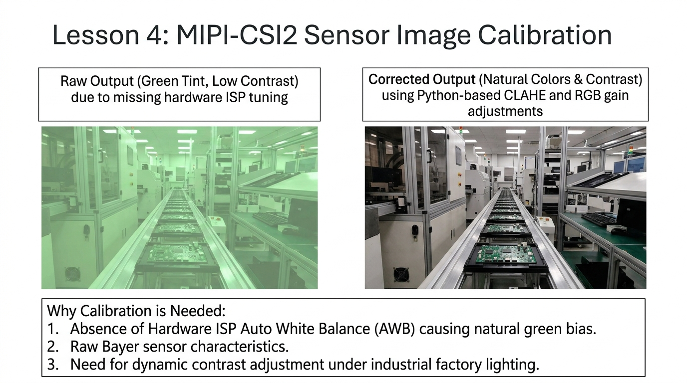

### 5. Multi-Camera Core-to-Core Frame Transmission
*   **Insight**: Utilizing SWD debug paths (ADB/OpenOCD memory dumps) to bridge frames from the STM32 MCU to the Linux web server introduces substantial latency (taking several seconds per frame).
*   **Takeaway**: While acceptable for a prototype testing layout, a production-grade implementation should configure a dedicated high-speed SPI slave driver on the Qualcomm Linux kernel. This would allow the STM32 SPI master to transmit image frames directly over the hardware interface pins at maximum bandwidth.

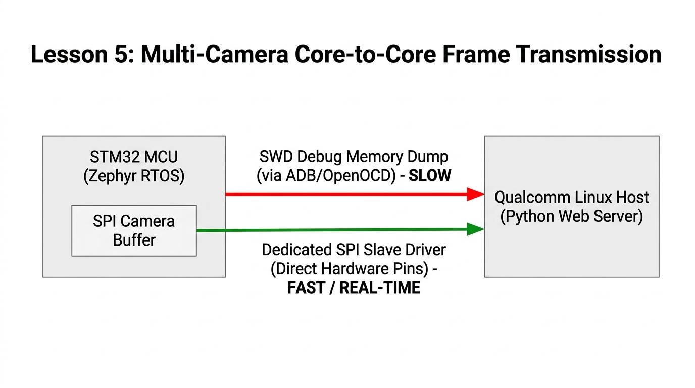

---

## 7. Conclusion

By combining the high-speed processing power of the Qualcomm QRB2210 Linux Host with the low-latency, low-power control of the STM32 Zephyr RTOS MCU, **The Hybrid Guard** successfully implements:
1. **Triple-Camera Vision Coverage**: Seamlessly orchestrating MIPI-CSI2, USB, and SPI cameras on a single board to inspect PCBs from three distinct angles.
2. **On-Device Edge AI Detections**: Running real-time object classification and bounding-box models trained via Edge Impulse on both the Linux host and the RTOS microcontroller.
3. **Synchronized Multi-Angle Frame Saving**: Supporting one-click snapshots across all three cameras for dataset collection and logging.

This project was built for the [Invent the Future with Arduino UNO Q and App Lab](https://www.hackster.io/contests/invent-the-future-with-arduino-uno-q-and-app-lab) contest.

---

## 8. References & License

This has been a great fun challenge.
Thanks to Arduino, Qualcomm and Edge Impulse for hosting this exciting program. Thank you very much for all the support provided.

### References

This project builds upon and references the following resources:
*   **Custom MIPI-CSI2 Add-on Board (camboard-uno-q)**: [https://github.com/RevLmt/camboard-uno-q](https://github.com/RevLmt/camboard-uno-q)
*   **PCB Dataset (Roboflow 100 Printed Circuit Board)**: [https://universe.roboflow.com/roboflow-100/printed-circuit-board](https://universe.roboflow.com/roboflow-100/printed-circuit-board)

---

### License

*   The custom scripts, firmware, and overall orchestration code in this repository are licensed under the **Apache License 2.0**.
*   **Edge Impulse Models & SDK**: Due to licensing agreements and subscription terms (Edge Impulse platform restrictions), the pre-compiled model binary files (`.eim`) and the generated C++ SDK folders (`edge-impulse-sdk/`, `model-parameters/`, and `tflite-model/`) are not hosted in this GitHub repository. Developers are expected to generate and export their own SDK variations or model binaries directly from their Edge Impulse Studio project.
*   **Arduino App Lab Boilerplate Code**: The boilerplate code in the `usb-cam/` directory is licensed under the **Mozilla Public License 2.0 (MPL-2.0)** by Arduino s.r.l. and retains its original headers.
*   **Third-Party References**: The board design from [camboard-uno-q](https://github.com/RevLmt/camboard-uno-q) and the Roboflow 100 PCB dataset from [Roboflow Universe](https://universe.roboflow.com/roboflow-100/printed-circuit-board) are subject to their respective original licenses.